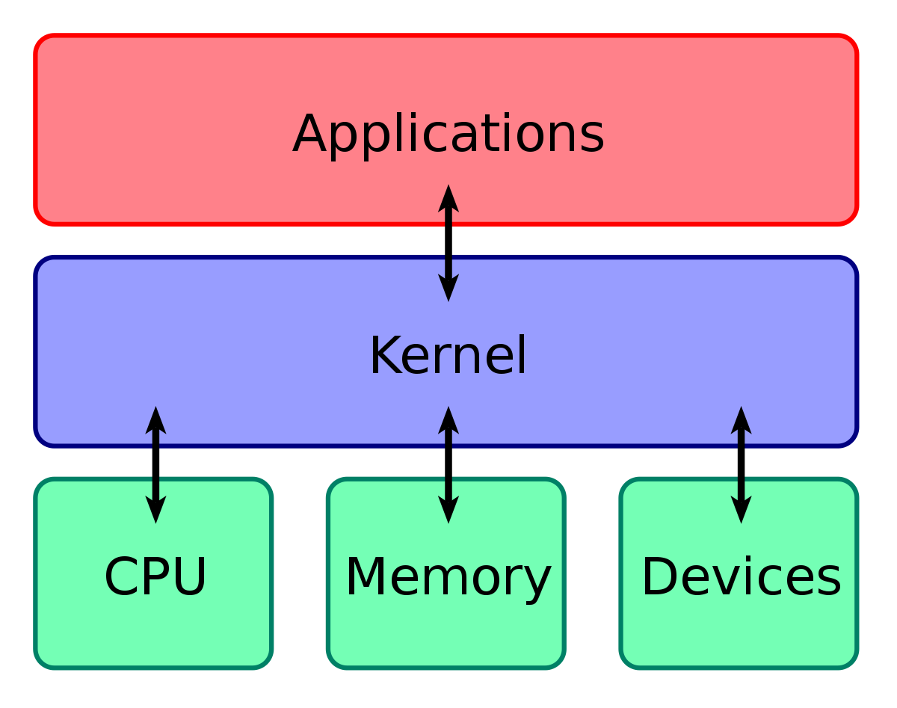
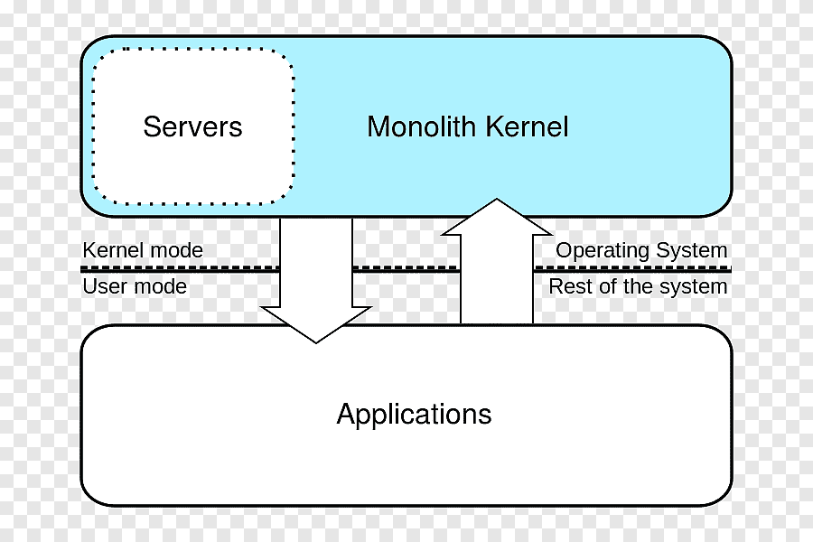
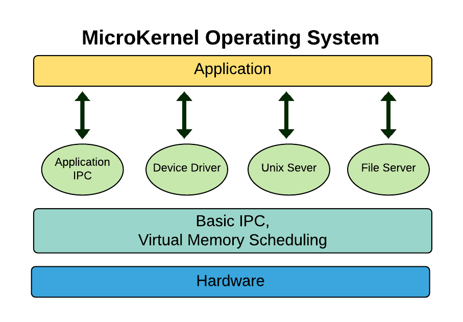
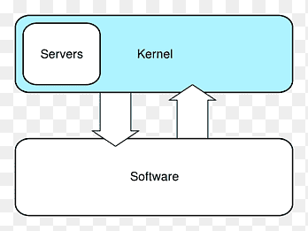
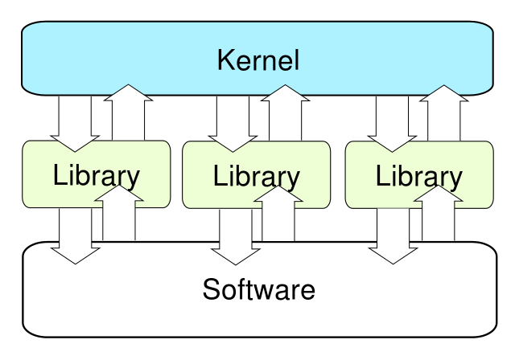
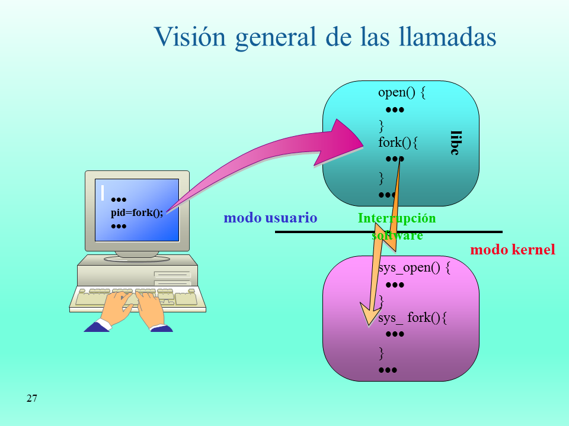

# ACTIVIDAD 1

## Kernel  
El kernel se encarga de la organizacion de procesos  datos de cada ordenador  
en el segundo plano. Sin el practicamente nada funciona. Es la interfaz entre el software y el hardware.  
Es el corazon del sistema operativo

# Tipos De Kernel  

## Kernel Monolitico  
Es un kernel grande para todas las tareas, como la gestion de la memoria y de los procesos,  
proporciona funciones de soporte de drivers y hardware. Algunos sistemas que utilizan el  
kernel monolitico son Linux y Windows. Un conjunto primitivo de llamadas al sistema implementa  
todos los servicios propios del sistema operativo como sistema de archivos, gestion de memoria entre otros.  

Este kernel esta programado de forma no modular y puede tener un tamaño considerable. A su vez  
si se agregan nuevas caracteristicas, el kernel debera ser recompilado en su totalidad y luego  
se debera reiniciar. Como tiene acceso a todas las estructuras y rutinas, un error de estos podria  
propagarse a todo el sistema  

## Microkernel  
Este tipo de kernel se ha diseñado de forma que sea pequeño para que en caso de existir alguna  
falla no condicione o paralice a todo el sistema, esto se logra ya que esta dividido en varios  
modulos, un sistema operativo que implementa esta estructura en Mach de OS X. Provee un conjunto  
de llamadas minimas al sistema para implementar los servicios basicos como comunicacion entre  
procesos y planificacion basica. Los demas servicios como gestion de memoria, sistema  
de archivos, entre otros, se ejecutan como procesos servidores en el espacio de usuario.  

El paradigma de este nucleo se penso para que se crearan sistemas independientes  
que fuesen capaces de superar por si mismo errores de software y hardware sin condicionar el  
funcionamiento del sistema. Creando una mejora en la tolerancia a fallos y aumentando la portabilidad  
para diferentes plataformas de hardware.

## Kernel Hibrido  
La combinacion de los tipos de kernel anteriormente descritos dan como resultado el kernel hibrido  
El kernel monolitico se hace mas compacto y modular, haciendo que ciertas partes del kernel  
puedan cargarse dinamicamente.  

El proposito de esta implementacion fue para cargar unicamente codigo escensial del kernel  
para mejorar el rendimiento y aplicar la alta tolerancia a fallos que representa la  
arquitectura del microkernel.

## Kernel Exonucleo  
Este es un tipo de kernel que aun se encuentra en investigacion, con el proposito de crear  
una capa de software para otros sistemas virtuales. Son nucleos pequeños ya que su proposito es asegurar la proteccion y el multiplexado de los recursos  
haciendo mucho mas simple las implementaciones para la comunicacion entre el kernel y el hardware.  

Las aplicaciones pueden pedir direcciones especificas de memoria, bloques en el disco,  
entre otros, si el recurso se encuentra libre se permite a la aplicacion utilizarlo. Este acceso  
al hardware permite al programador implementar las llamadas al sistema de forma personalizada  
cumpliendo con las necesidades del usuario y asi obtener un mejor rendimiento del sistema  
operativo.

# Modo Kernel vs. Modo Usuario  

| Caracteristica         |                  Kernel Mode                  |                                                  User Mode |
| :--------------------: | :-------------------------------------------: | :--------------------------------------------------------: |
| Interrupciones         |     Se detiene todo el sistema operativo      |                         El programa de la aplicacion falla |
| Modo                   |               Modo Privilegiado               |                                           Modo Restringido |
| Espacio de Direcciones | Todos los procesos comparten un unico espacio |              Los procesos obtienen un espacio por separado |
| Restricciones          |      Puede acceder a todos los programas      |      Unicamente accede a los programas a traves del kernel |
| Referencias de Memoria |        Puede acceder a toda la memoria        | Unicamente puede acceder a la memoria destinada al usuario |
| Fallos Del Sistema     |         Puede detener todo el sistema         |        Se puede recuperar de un fallo reanudando la sesion |

